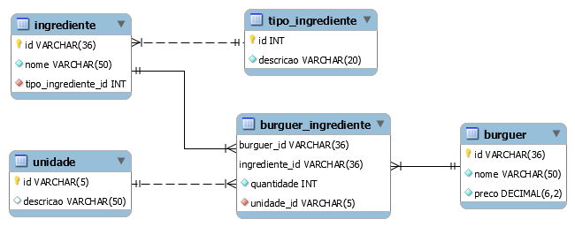

# 🍔 hamburgueria-mysql

`Hamburgueria` - banco de dados de exemplo em MySQL.

Contém um cadastro de burguers para uma hamburgueria fictícia cujos burguers possuem nomes relacionados ao [Dev C#](https://github.com/ermogenes/aulas-programacao-csharp) e ao [Dev Web](https://github.com/ermogenes/aulas-programacao-web).

## Como carregar

Usando o MySQL Workbench, selecione _File_, _Run Script SQL..._.


Selecione o arquivo contido em [`scripts/hamburgueria.sql`](scripts/hamburgueria.sql).

Selecione o conjunto de caracteres `utf8` e execute clicando em _Run_.


_Se preferir, você pode usar outro cliente, como o DBeaver, por exemplo._

## Modelo de dados

Arquivo do MySQL Workbench: [`model/hamburgueria.mwb`](model/hamburgueria.mwb)

**Diagrama Entidade-Relacionamento**



## Dados 

Listagem dos burguers e seus ingredientes:

nome|preco|quantidade|unidade|ingrediente|tipo
---|---|---|---|---|---
String|9.99|1|unidade(s)|Pão Comum|Pão
String|9.99|130|grama(s)|Burguer de Fraldinha|Carne
String|9.99|1|porção(ões)|Queijo Muçarela|Extra
Arrow function|12.99|1|unidade(s)|Pão Integral|Pão
Arrow function|12.99|150|grama(s)|Burguer Mix da Casa|Carne
Arrow function|12.99|1|porção(ões)|Bacon|Extra
Arrow function|12.99|1|porção(ões)|Cheddar|Extra
Seletor CSS|12.99|1|unidade(s)|Pão com Gergelim|Pão
Seletor CSS|12.99|150|grama(s)|Burguer Mix da Casa|Carne
Seletor CSS|12.99|1|porção(ões)|Alface|Extra
Seletor CSS|12.99|1|porção(ões)|Mostarda|Extra
git push|25.00|1|unidade(s)|Pão Australiano|Pão
git push|25.00|200|grama(s)|Burguer de Picanha|Carne
git push|25.00|1|porção(ões)|Bacon|Extra
git push|25.00|1|porção(ões)|Cheddar|Extra
git push|25.00|1|porção(ões)|Jalapeño|Extra
git push|25.00|1|porção(ões)|Mostarda|Extra

_Script_

```sql
USE hamburgueria;
SELECT 
    b.nome,
    b.preco,
    bi.quantidade,
    u.descricao AS unidade,
    i.nome AS ingrediente,
    ti.descricao AS tipo
FROM
    burguer b
        INNER JOIN
    burguer_ingrediente bi ON bi.burguer_id = b.id
        INNER JOIN
    ingrediente i ON bi.ingrediente_id = i.id
        INNER JOIN
    unidade u ON bi.unidade_id = u.id
        INNER JOIN
    tipo_ingrediente ti ON i.tipo_ingrediente_id = ti.id
ORDER BY b.preco , b.nome , ti.id , i.nome;
```
